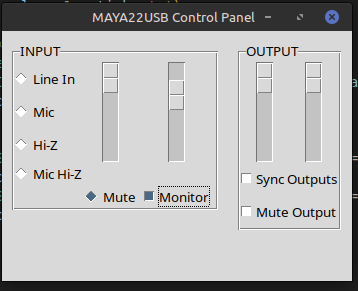

# ESI Maya22 Controller

This project provides a graphical interface to control the ESI Maya22 hardware via terminal commands. The interface allows you to adjust input and output volumes, enable/disable monitoring and headphones, and synchronize output volumes. Configuration is automatically saved to a JSON file.



## Executable Information

The `maya22-control` executable used in this project comes from the [rabits/esi-maya22-linux](https://github.com/rabits/esi-maya22-linux) repository. However, I have optionally included a modified `maya22-control` file that adds an additional option to disable headphones, which the original version does not support.

It is recommended to use the modified executable included in this repository to take advantage of this additional functionality. However, if you prefer to use the original executable, you can download it from the mentioned repository, although you will lose the option to disable headphones.

## Features

- Adjust input volumes (left and right).
- Adjust output volumes (left and right).
- Automatic synchronization of output volumes.
- Enable and disable monitoring.
- Enable and disable headphones.
- Select input channel.
- Automatic configuration saving in a JSON file.

## Requirements

- Python 3.x
- Tkinter (generally included with Python)
- `maya22-control` executable in the same directory as this script

### For Debian/Ubuntu Systems

To install the required dependencies using `apt-get`, follow these steps:

1. Update your package list:

   `sudo apt-get update`

2. Install the necessary packages:

   `sudo apt-get install python3 python3-tk `

This will install Python 3, the Tkinter GUI toolkit, and HID support.

### For Arch Linux Systems

To install the required dependencies using `pacman`, follow these steps:

1. Update your system:

   `sudo pacman -Syu`

2. Install the necessary packages:

   `sudo pacman -S python python-tk `

These commands will install Python, Tkinter, and HID support on Arch Linux.


## Installation

1. Clone this repository:

   ```bash
   git clone  https://github.com/piposeimandi/esi-maya22-linux-gui
   ```
2. Navigate to the project directory:

   ```bash
   cd tu_repositorio
   ```
3. Ensure the `maya22-control` executable is accessible:

   - Use the modified executable included in this repository.
   - If you choose to use the original executable, download it from the [rabits/esi-maya22-linux](https://github.com/rabits/esi-maya22-linux) repository.
   - Place the executable in the same directory as the Python script.
   - Ensure it is executable:
     ```bash
     chmod +x maya22-control
     ```

## Usage

1. Run the Python script:

   ```bash
   python maya22-gui.py
   ```
2. The graphical interface will open, and you will be able to adjust volumes, enable/disable monitoring and headphones, and select the input channel.

## Configuration

Configuration is saved in a JSON file named `config.json` in the same directory as the script. Settings are automatically loaded from this file when the application starts.

### Configuration File

The `config.json` file contains the following parameters:

- `mute_output`: mute all output (0 or 1).
- `monitoring_enabled`: Monitoring status (0 or 1).
- `input_vol_left`: Input volume left (0-127).
- `input_vol_right`: Input volume right (0-127).
- `output_vol_left`: Output volume left (0-145).
- `output_vol_right`: Output volume right (0-145).
- `input_channel`: Selected input channel (`mic`, `hiz`, `line`, `mic_hiz`, `mute`).

## Known Issues

- If you encounter any issues running the commands, make sure that `maya22-control` is correctly located and executable.

## Contributions

Contributions are welcome. If you find any bugs or have improvements to propose, please open an issue or a pull request.

## License

This project is licensed under the MIT License. See the [LICENSE](LICENSE) file for more details.

## Contact

For any questions or comments, please contact [bajosega@gmail.com](mailto:bajosega@gmail.com).
