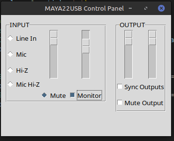

# ESI Maya22 Controller

This project provides a graphical interface to control the ESI Maya22 hardware via terminal commands. The interface allows you to adjust input and output volumes, enable/disable monitoring and headphones, and synchronize output volumes. Configuration is automatically saved to a JSON file.



## Executable Information

The `maya22-control` executable used in this project comes from the [rabits/esi-maya22-linux](https://github.com/rabits/esi-maya22-linux) repository. However, I have optionally included a modified `maya22-control` file that adds an additional option to disable headphones, which the original version does not support.

It is recommended to use the modified executable included in this repository to take advantage of this additional functionality. However, if you prefer to use the original executable, you can download it from the mentioned repository, although you will lose the option to disable headphones.

## Features

- Adjust input volumes (left and right).
- Adjust output volumes (left and right).
- Automatic synchronization of output volumes.
- Enable and disable monitoring.
- Enable and disable headphones.
- Select input channel.
- Automatic configuration saving in a JSON file.

## Requirements

- Python 3.x
- CustomTkinter (`pip install customtkinter`)
- Pillow (`pip install Pillow`)
- `maya22-control` executable (included)

### System Dependencies (Debian/Ubuntu)

```bash
sudo apt install python3 python3-tk python3-pil python3-pil.imagetk python3-gi
```

### System Dependencies (Arch Linux)

```bash
sudo pacman -S python python-tk python-pillow python-gobject
```


## Installation via .deb Package

1. Build the package:

   ```bash
   ./build-deb.sh
   ```

2. Install with apt (resolves dependencies automatically):

   ```bash
   sudo apt install ./build/maya22-gui_1.0.0-1.deb
   ```

3. Install customtkinter (not available in Debian repos):

   ```bash
   pip install customtkinter
   ```

## Manual Usage

1. Install dependencies:

   ```bash
   sudo apt install python3 python3-tk python3-pil python3-pil.imagetk python3-gi
   pip install customtkinter Pillow
   ```

2. Run directly:

   ```bash
   ./maya22-gui.py
   ```
   
   The graphical interface will open and you can adjust volumes, select input channels, and toggle monitoring/headphones.

## Configuration

Configuration is saved in a JSON file named `config.json` in the same directory as the script. Settings are automatically loaded from this file when the application starts.

### Configuration File

The `config.json` file contains the following parameters:

- `mute_output`: mute all output (0 or 1).
- `monitoring_enabled`: Monitoring status (0 or 1).
- `input_vol_left`: Input volume left (0-127).
- `input_vol_right`: Input volume right (0-127).
- `output_vol_left`: Output volume left (0-145).
- `output_vol_right`: Output volume right (0-145).
- `input_channel`: Selected input channel (`mic`, `hiz`, `line`, `mic_hiz`, `mute`).

## Known Issues

- If you encounter any issues running the commands, make sure that `maya22-control` is correctly located and executable.

## Contributions

Contributions are welcome. If you find any bugs or have improvements to propose, please open an issue or a pull request.

## License

This project is licensed under the MIT License. See the [LICENSE](LICENSE) file for more details.

## Contact

For any questions or comments, please contact [bajosega@gmail.com](mailto:bajosega@gmail.com).
